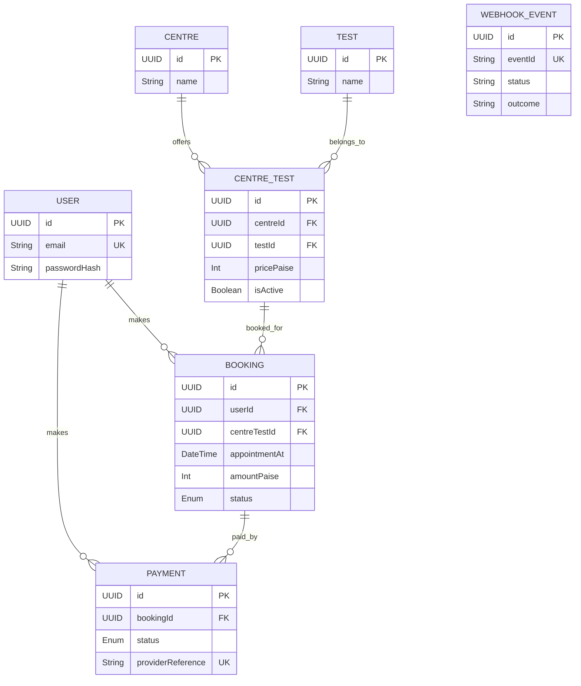
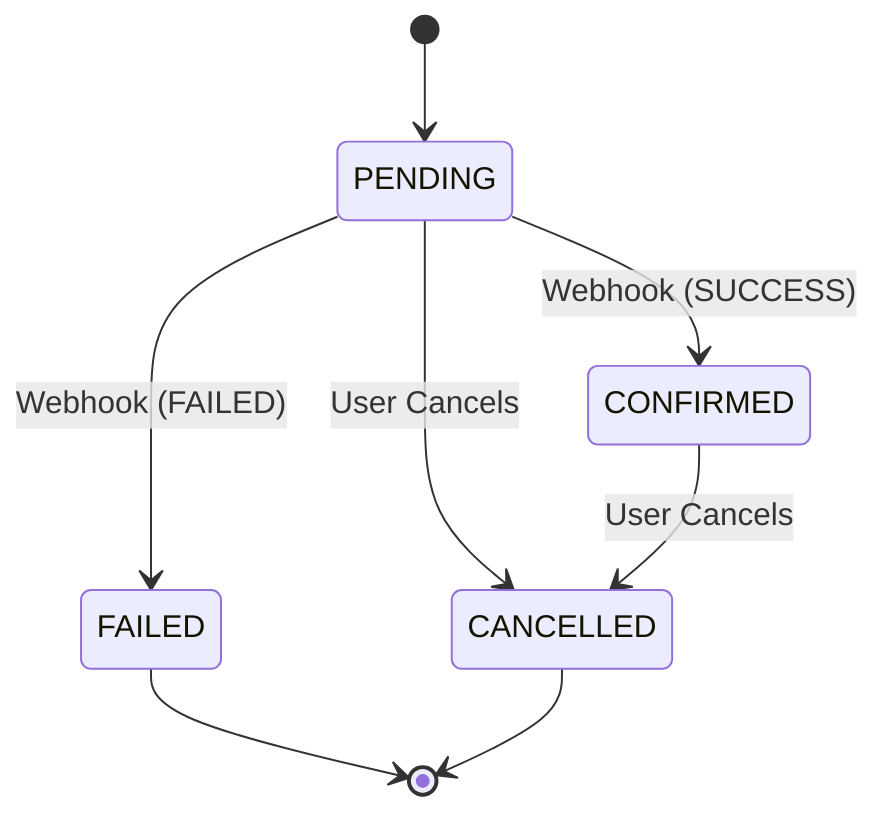

# EVE Healthcare Diagnostic API

## 1. Overview + Tech Stack and Why
This is a robust, highly-concurrent backend API for a diagnostic center booking system. 
**Tech Stack:**
- **Language**: TypeScript (strict mode) for end-to-end type safety and developer productivity.
- **Runtime/Framework**: Node.js v20 + Express. A lightweight, proven, and highly performant foundation for web servers.
- **Database**: PostgreSQL for strict ACID compliance, robust constraint checking, and concurrency control.
- **ORM**: Prisma for type-safe database access, automated migrations, and declarative schema modeling.
- **Validation**: Zod for runtime data validation, deeply integrated with TypeScript.
- **Testing**: Vitest for fast, concurrent unit and integration testing.
- **Logging**: Pino (and pino-http) for extremely fast JSON structured logging.

## 2. Quick Start
### Prerequisites
- Node.js v20+
- PostgreSQL v15+ (Local or Docker)

```bash
# 1. Clone and install dependencies
git clone https://github.com/miran5624/DiagTestBackend---Miran-Rahman---Eve-HealthCare.git
cd DiagTestBackend---Miran-Rahman---Eve-HealthCare
npm install

# 2. Setup Environment Variables
cp .env.example .env
# Edit .env with your local PostgreSQL credentials

# 3. Apply Migrations and Seed the Database
npx prisma migrate reset --force
# (This will drop the DB, apply migrations, and run prisma/seed.ts)

# 4. Run the Dev Server
npm run dev

# 5. Run the Test Suite
npm run verify
```

## 3. API Reference & Examples
Full OpenAPI 3.0 Documentation is available at `GET /docs` when the server is running.

| Endpoint | Method | Description |
|---|---|---|
| `/health` | GET | Health check endpoint |
| `/auth/signup` | POST | Register a new user |
| `/auth/login` | POST | Login and receive a JWT |
| `/auth/me` | GET | Get authenticated user info |
| `/bookings` | POST | Create a diagnostic test booking |
| `/bookings/:id` | GET | Get a specific booking |
| `/bookings/:id/cancel`| POST | Cancel a booking |
| `/payments/webhook`| POST | Handle payment provider webhooks |

**Webhook Simulation:**
You can simulate a webhook call via the included script:
```bash
npx tsx scripts/smoke.ts
# This will execute a full end-to-end smoke test including a signed webhook request.
```

## 4. Database Schema Design

**Reasoning:**
- `pricePaise` on `CentreTest`: Prices can vary by centre and are stored in integer `paise` (cents) to avoid floating-point errors.
- `amountPaise` on `Booking`: Snapshotted at booking time so historical bookings don't change if the centre updates their price.
- `eventId` on `WebhookEvent`: Enforces idempotency via a `UNIQUE` constraint. Duplicate webhook events are rejected or ignored at the DB level.
- Partial Unique Index on `Booking`: Enforced via `WHERE "status" IN ('PENDING', 'CONFIRMED')` on `userId`, `centreTestId`, `appointmentAt` to prevent double-booking the exact same test simultaneously.

## 5. Booking State Machine & Webhooks

**Webhook Idempotency & Concurrency:**
- Every webhook payload includes a unique `eventId`.
- We attempt to insert this `eventId` into the `WebhookEvent` table within a transaction.
- If it fails due to a unique constraint violation, we immediately return 200 OK (Duplicate).
- Next, we use a Row Lock (`SELECT ... FOR UPDATE`) on the `Payment` to prevent race conditions if out-of-order webhooks try to update the same payment simultaneously.
- Finally, state transitions are validated by `BookingStateMachine`. Invalid transitions are ignored, preventing a `CANCELLED` booking from reverting to `CONFIRMED`.

## 6. Edge Cases Handled
- Concurrent duplicate webhooks (Handled by DB constraint, tested in `smoke.ts`).
- Out-of-order webhooks (Handled by strict State Machine).
- Re-booking cancelled slots (Allowed by partial DB index).
- Booking a past date (Handled by Zod schema and Service validation).
- Accessing another user's booking (Prevented by `userId` checks in Service layer).
- Over-sized JSON payloads (Handled by Express limits).
- Rate Limiting (Stricter on Auth endpoints).
- Missing/Invalid Webhook Signatures (Tested in `webhook.test.ts`).

## 7. Assumptions
- Payments are handled by an external provider that pushes webhooks.
- A `FAILED` booking is a terminal state. The user must create a new booking rather than retrying payment for the failed one.
- No refunds are processed currently for `CONFIRMED` -> `CANCELLED` transitions.
- All times are handled in UTC (`appointmentAt` uses ISO8601).

## 8. Future Improvements
- **Queue-Based Webhooks**: Use BullMQ/Redis or AWS SQS to queue webhooks immediately and process them asynchronously for higher throughput.
- **Caching**: Implement Redis for `GET /centres` and `GET /tests` endpoints.
- **Outbox Pattern**: Use the transactional outbox pattern to emit events when a booking is created, ensuring reliable messaging to other microservices.
- **Auth**: Introduce Refresh Tokens for better session management and Role-Based Access Control (RBAC) for Admin vs User routes.
- **Capacity**: Add a hard limit to the number of concurrent bookings a Centre can take per hour.
- **Observability**: Integrate Prometheus metrics and tracing via OpenTelemetry.
